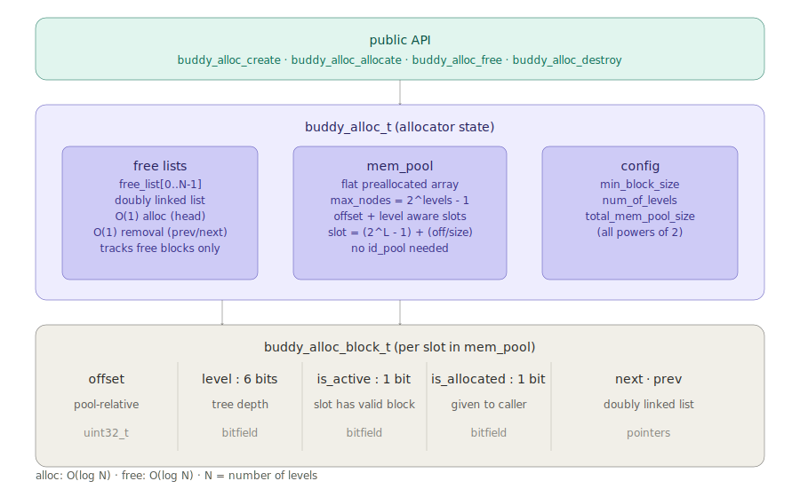
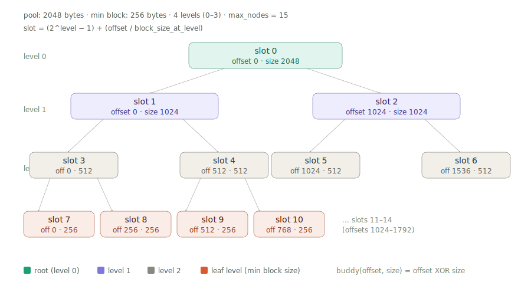

# Buddy Allocator

A buddy system memory allocator written in C. Manages a virtual address space
(offset-based, no real memory backing) with O(log N) allocation and O(log N) free,
where N is the number of levels in the buddy tree.

---

## Overview

The buddy allocator divides a fixed memory pool into power-of-2 sized blocks
arranged in a binary tree. Each level of the tree holds blocks of the same size.
When a block is split, it produces two equal "buddy" blocks at the next level.
When both buddies are free, they are merged back into their parent.

The allocator is configured with a `total_mem_pool_size` and a `min_block_size`,
both of which must be powers of 2.

---

## Architecture

### High-level structure



The allocator has three layers:

- **Public API** — `buddy_alloc_create`, `buddy_alloc_allocate`, `buddy_alloc_free`, `buddy_alloc_destroy`
- **Allocator state** (`buddy_alloc_t`) — holds the free lists, the mem_pool, and config
- **Block struct** (`buddy_alloc_block_t`) — one per slot in the flat block array

### Buddy tree and slot layout



The flat block array uses an offset + level aware slot formula:

```
slot = (2^level - 1) + (offset / block_size_at_level)
```

This gives every `(level, offset)` pair a unique, computable index into the
preallocated array — no `id_pool` or dynamic allocation needed at runtime.

---

## Key design decisions

### Offset + level aware mem_pool

Rather than a generic pool managed by an `id_pool` (which assigns indices
sequentially and is unaware of offset or level), the mem_pool slots are addressed
directly by the slot formula. This means:

- Given a block's `(level, offset)`, its `block*` is retrieved in O(1)
- The buddy's slot is computed directly: `buddy_offset = offset XOR block_size`,
  then `buddy_slot = (2^level - 1) + (buddy_offset / block_size)`
- No linear scan of the free list is needed to find the buddy during free

### Doubly linked free lists

Each level has a doubly linked free list (`next` + `prev` pointers inside the block struct).
This enables O(1) removal of any node once a direct pointer to it is known — critical
for the merge operation during `buddy_alloc_free`, where the buddy block must be
unlinked from the middle of the free list without scanning from the head.

### `is_active` and `is_allocated` flags

Each block slot carries two 1-bit flags:

| Flag | Meaning |
|---|---|
| `is_active = 0` | slot is empty (never used, or consumed by a merge) |
| `is_active = 1, is_allocated = 0` | block exists and is in the free list |
| `is_active = 1, is_allocated = 1` | block has been given to the caller |

This avoids ambiguity between an empty slot (default zero from `calloc`) and a
legitimately free block.

---

## Complexity

| Operation | Complexity |
|---|---|
| `buddy_alloc_allocate` | O(log N) — at most one pass upward through the levels to find a non-empty free list, then one pass downward splitting blocks to the target level. Both passes are bounded by num_of_levels. |
| `buddy_alloc_free` | O(log N) — at most one pass up the levels merging with buddies |
| buddy lookup during free | O(1) — direct slot computation, no list scan |
| buddy removal from free list | O(1) — doubly linked list unlink |

N = total_size / min_block_size  (max number of concurrently allocated blocks)
num_of_levels = log2(N) + 1
complexity = O(log N) (which is O(num_of_levels))

---

### `buddy_alloc_allocate` algorithm

1. Round up `block_size` to the next power of 2
2. Compute `target_level` from the rounded size
3. Check the free list at `target_level` — if non-empty, take the head block, mark `is_allocated = true`, return it
4. If empty, search upward (toward level 0) for the first non-empty free list
5. If no free block exists at any level, return `-ENOMEM`
6. Take the head block at the found level, remove it from the free list, mark its slot `is_active = false`
7. Split downward: for each level from `found_level + 1` to `target_level`, create only the buddy block
   at the new level (the block at `block_offset` is not created at intermediate levels — it continues
   splitting down to the next level), set `is_active = true`, add the buddy to that level's free list
8. Create the target block at `target_level` with the correct offset, set `is_active = true`,
   `is_allocated = true`, return it

---

### `buddy_alloc_free` algorithm

1. Set the block's `is_active = false`
2. Compute `buddy_offset = offset XOR block_size`
3. Compute `buddy_slot` using the slot formula, get `buddy_block*` directly from the pool — O(1)
4. Check if buddy is free: `buddy_block->is_active == true && buddy_block->is_allocated == false`
5. If buddy is not free — create a new block at `(current_level, block_offset)`, set `is_active = true`,
   `is_allocated = false`, add to free list, stop
6. If buddy is free — remove buddy from free list (O(1) via `prev`/`next`), set `buddy_block->is_active = false`
7. Update: `block_size <<= 1`, `block_offset = MIN(block_offset, buddy_offset)`, `current_level--`
8. Repeat from step 2 until level 0 or no free buddy found
9. Create the final merged block, add to free list

## Public API

```c
int buddy_alloc_create(buddy_alloc_cfg_t *b_cfg, buddy_alloc_t **b_alloc);
int buddy_alloc_destroy(buddy_alloc_t *b_alloc);
int buddy_alloc_allocate(buddy_alloc_t *b_alloc, uint32_t block_size, buddy_alloc_block_t **block_out);
int buddy_alloc_free(buddy_alloc_t *b_alloc, buddy_alloc_block_t *block);

int buddy_alloc_get_num_of_levels(const buddy_alloc_t *b_alloc, uint32_t *num_of_levels);
int buddy_alloc_count_free_blocks(const buddy_alloc_t *b_alloc, uint32_t level, uint32_t *free_blocks_num);
int buddy_alloc_get_block_level(const buddy_alloc_block_t *blk, uint32_t *blk_level);
int buddy_alloc_get_block_offset(const buddy_alloc_block_t *blk, uint32_t *blk_offset);
```

`buddy_alloc_block_t` is an opaque type — the caller holds a pointer as a handle
and passes it back to `buddy_alloc_free`. Internal fields are not accessible outside
the module.

---

## Configuration

```c
typedef struct {
    uint32_t total_mem_pool_size;  // must be a power of 2
    uint32_t min_block_size;       // must be a power of 2, <= total_mem_pool_size
} buddy_alloc_cfg_t;
```

---

## Building and running tests

```bash
mkdir -p BUDDY_ALLOCATOR/build && cd BUDDY_ALLOCATOR/build
cmake ..
make
ctest --output-on-failure
```

Requires CMake 3.10+ and GTest.
